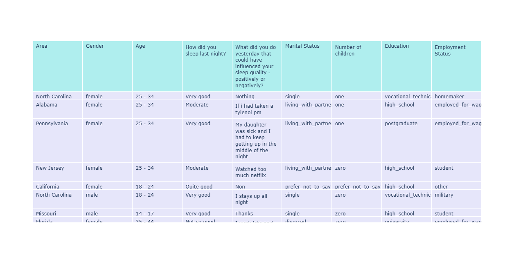
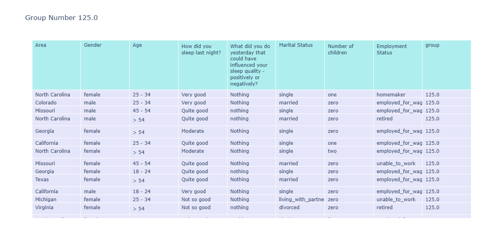
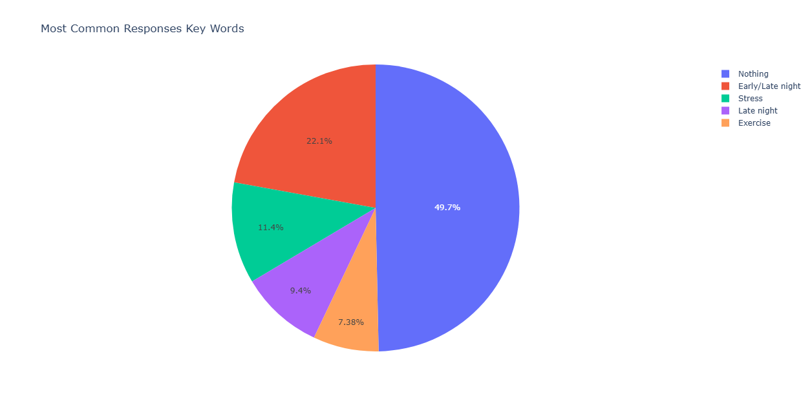

# Sleep_Quality_Survey
Analysing data from a survey on sleep quality in relation to what the person did before bed.  For this project, the data will be cleansed first, then sorted into groups of similar responses for analysis. _[View survey-sleep.xlsx](data-and-code/survey-sleep.xlsx)_ from https://caplena.com/en/blog/text-analytics-getting-started-with-datasets

## Modules Used:


[](https://huggingface.co/sentence-transformers)


## The Code 
Importing the libraries used in this project.
```python
import pandas as pd 
from sentence_transformers import SentenceTransformer
from sklearn.cluster import AgglomerativeClustering
from collections import Counter
import plotly.graph_objects as go
import plotly.express as px
import plotly.io as pio
```

The columns ID, OS, Country and Education contain statistics that have no substantial influence on respondents' sleep quality.  These columns are removed from the dataframe. The dataframe is then visualised in plotly. 
```python
data = pd.read_excel("survey-sleep.xlsx")
data = data.drop(columns=['ID', 'OS','Country','Education'])
table1 = go.Figure(data=[go.Table(
    header=dict(values=list(data.columns),
                fill_color='paleturquoise',
                align='left'),
    cells=dict(values=[data.Area, data.Gender, data.Age, data['How did you sleep last night?'], data['What did you do yesterday that could have influenced your sleep quality - positively or negatively?'], data['Marital Status'], data['Number of children'], data['Employment Status']],
               fill_color='lavender',
               align='left'))
])
pio.renderers.default = "browser"
table1.show()
```


This newly created dataframe will be used for analysis.  The data will be organised into clusters depending on the similarity of responses.

```python
model = SentenceTransformer('all-MiniLM-L6-v2') 
column_name = 'What did you do yesterday that could have influenced your sleep quality - positively or negatively?'
text = data[column_name].dropna().astype(str) 
embeddings = model.encode(text.tolist()) 
clustering_model = AgglomerativeClustering(n_clusters=None, distance_threshold=0.3, metric='cosine', linkage='average') 
cluster_labels = clustering_model.fit_predict(embeddings) 
data.loc[text.index,'group'] = cluster_labels
grouped = data.groupby('group')[column_name].agg(list).reset_index()
grouped['Number of People'] = grouped[column_name].apply(len) 
```

As the total number of groups exceeds 200, tally the group sizes and present the top five most common responses.  The most typical response that influences sleep quality is doing nothing the day before.

```python
cluster_counts = data['group'].value_counts().head(5)
top_cluster_ids = cluster_counts.index.tolist()

for cluster_id in top_cluster_ids:
    cluster_df = data[data['group'] == cluster_id]

    fig = go.Figure(data=[go.Table(
        header=dict(values=list(cluster_df.columns),
                    fill_color='paleturquoise',
                    align='left'),
        cells=dict(values=[cluster_df[col].astype(str) for col in cluster_df.columns],
                   fill_color='lavender',
                   align='left'))
    ])

    fig.update_layout(title_text=f"Group Number {cluster_id} ")
    pio.renderers.default = "browser"
    fig.show()
```



A pie chart displaying the top five responses is generated.  Inaccuracies were found in group 15, which contained a combination of responses from persons sleeping too late and too early.

```python
response_count = []

for cluster_id in top_cluster_ids:
    cluster_df = data[data['group'] == cluster_id]
    response_count.append(len(cluster_df))

    fig = go.Figure(data=[go.Table(
        header=dict(values=list(cluster_df.columns),
                    fill_color='paleturquoise',
                    align='left'),
        cells=dict(values=[cluster_df[col].astype(str) for col in cluster_df.columns],
                   fill_color='lavender',
                   align='left'))
    ])

    fig.update_layout(title_text=f"Group Number {cluster_id} ")
    pio.renderers.default = "browser"
    fig.show()

pie = pd.DataFrame({'Group Number': top_cluster_ids , 'Response Count': response_count, 'Key Word' : ['Nothing', 'Early/Late night', 'Stress', 'Late night', 'Exercise']})
fig2 = px.pie(pie, values='Response Count', names='Key Word',title='Most Common Responses Key Words')
pio.renderers.default = "browser"
fig2.show()
```




